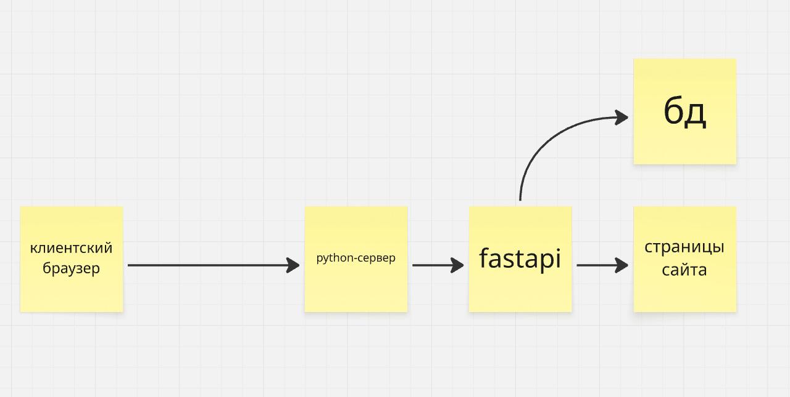

струкута каталагов проекта
```
main_dir
├── client
│   ├── pages
│   │   └── page.html
│   └── src
│   	└── chat.js
├── README.MD
└── server
    ├── local_data
    │   └── database.db
    ├── main.py
    └── src
        └── server_modules.py
```
инструкция к запуску
зависимости: python, websocket, asyncio, fastapi.

1. скачиванеи зависимостей (пример на arch linux)
```
sudo pacman -S python python-websocket python-asyncio python-fastapi
```
2. запуск сервера
```
python ./server/main.py
```
3. заходим на 127.0.0.1:8000
4. готово

архитектура сайта

