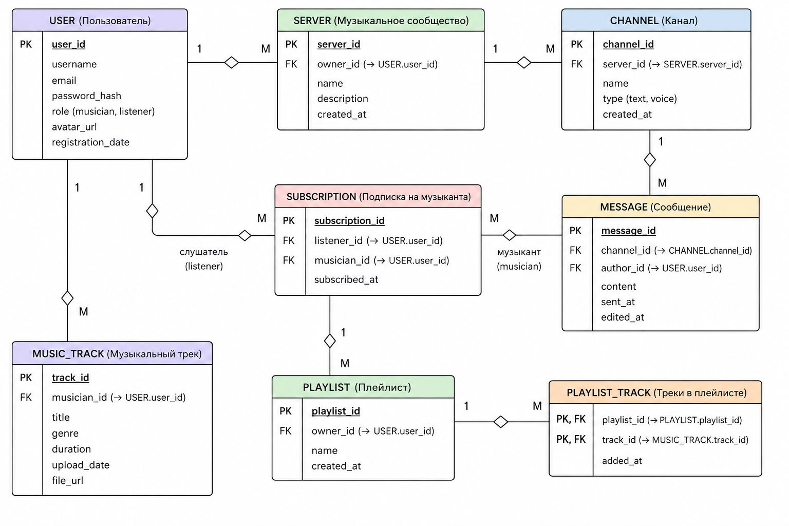

струкута каталагов проекта
```
main_dir
├── client
│   ├── pages
│   │   └── page.html
│   └── src
│   	└── chat.js
├── README.MD
└── server
    ├── local_data
    │   └── database.db
    ├── main.py
    └── src
        └── server_modules.py
```
инструкция к запуску
зависимости: python, websocket, asyncio, fastapi.

1. скачиванеи зависимостей (пример на arch linux)
```
sudo pacman -S python python-websocket python-asyncio python-fastapi
```
2. запуск сервера
```
python ./server/main.py
```
3. заходим на 127.0.0.1:8000
4. готово

архитектура сайта

er-диограмма бд


BACKLOG:
Легкие задачи (1–2 часа)
		Создание структуры базы данных
		Создать таблицы USER, SERVER, CHANNEL, MESSAGE, MUSIC_TRACK, PLAYLIST, PLAYLIST_TRACK, SUBSCRIPTION.
		Настроить первичные и внешние ключи.
		Регистрация пользователя
		Форма регистрации.
		Проверка уникальности email.
		Авторизация пользователя
		Вход по email и паролю.
		Создание пользовательской сессии.
		Редактирование профиля
		Изменение имени пользователя.
		Загрузка аватара.
		Создание музыкального сервера
		Форма создания сообщества.
		Сохранение владельца сервера.
		Просмотр списка серверов
		Отображение серверов, в которых состоит пользователь.
		Создание текстового канала
		Добавление канала внутри сервера.
		Отправка сообщений
		Отправка и сохранение сообщений в БД.
Средние задачи (3–6 часов)
		Просмотр истории сообщений
		Загрузка сообщений выбранного канала.
		Сортировка по времени отправки.
		Удаление и редактирование сообщений
		Доступ только автору сообщения.
		Загрузка музыкальных треков
		Загрузка mp3-файлов.
		Сохранение информации о треке.
		Страница музыканта
		Отображение профиля.
		Список опубликованных треков.
		Подписка на музыканта
		Создание записи в SUBSCRIPTION.
		Возможность отмены подписки.
		Создание плейлистов
		Создание пользовательских плейлистов.
		Добавление треков в плейлист
		Работа с таблицей PLAYLIST_TRACK.
		Поиск музыкантов
		Поиск по имени пользователя.
		Фильтрация по роли musician.
Сложные задачи (1–3 дня)
		Реализация голосовых каналов
		Подключение WebSocket.
		Поддержка подключения нескольких пользователей.
		Онлайн-статус пользователей
		Отображение статусов online/offline.
		Обновление в реальном времени.
		Уведомления о новых треках
		Автоматическое уведомление подписчиков.
		Отображение уведомлений в интерфейсе.
		Чат в реальном времени
		Передача сообщений через WebSocket.
		Мгновенное обновление без перезагрузки страницы.
